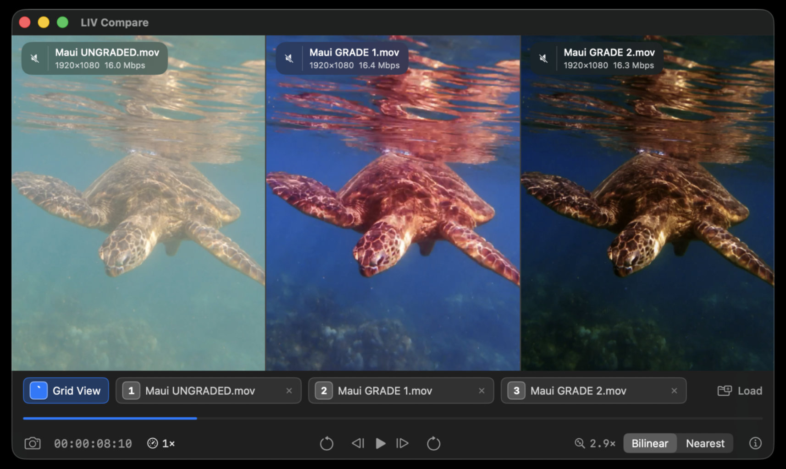

# LIV Compare

**A focused image and video comparison tool for macOS.**

Load up to four images or videos and compare them with synchronized playback in Multi-View, A/B, or Wipe mode. LIV Compare also supports matched-folder navigation, ACES2065-1 EXRs with the ACES 2.0 output transform, frame stepping, shared zoom and pan, playback speed controls, and screenshot export.

[**Download**](https://github.com/livcompare/livcompare.github.io/releases/latest) · [**Homepage**](https://livcompare.github.io)

## Issues & Feedback

If you run into a bug or have a feature request, please [open an issue](https://github.com/livcompare/livcompare.github.io/issues).

## License

Free to use for any purpose, including commercial. Provided as-is with no warranty. Redistribution of the app itself is not permitted.
